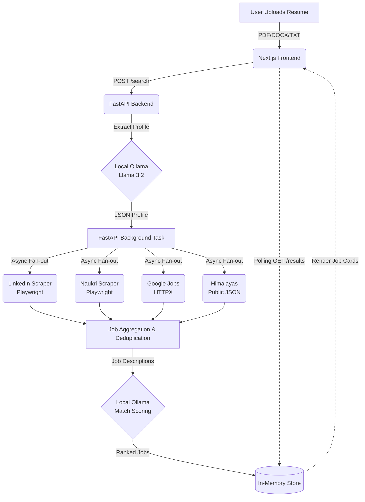

<div align="center">
  
# 🚀 Multi-Platform Job Search Workflow Automation
  
**An AI-powered, 100% local, and free job search automation tool.** <br>
Upload your resume, and let local AI and headless scrapers find and rank the best jobs for you across the web.


</div>

---

## ✨ Features

- 🧠 **100% Local AI Parsing**: Uses **Llama 3.2 (1B)** via Ollama running directly on your machine to extract skills, roles, and experience from your resume. No data leaves your computer.
- 🕷️ **Headless Web Scraping**: Bypasses the need for expensive API keys by scraping directly:
  - **LinkedIn** (via Playwright headless browser)
  - **Naukri** (via Playwright headless browser)
  - **Google Jobs** (Direct JSON-LD structured data extraction)
  - **Himalayas / Remote** (Public JSON RSS feeds)
- ⚡ **Asynchronous Architecture**: Built-in FastAPI background tasks run web scrapers concurrently without blocking the UI.
- 📊 **Intelligent Ranking**: The local Llama 3.2 model evaluates each scraped job description against your exact resume profile, generating a **0-100% Match Score**.
- 🎨 **Aesthetic UI**: A sleek, dark-themed, glassmorphic Next.js frontend built with Tailwind CSS and Lucide Icons.

---

## 🔄 How It Works (System Workflow)



---

## 🛠️ Tech Stack

| Layer | Technology | Purpose |
|---|---|---|
| **Frontend** | Next.js (App Router), Tailwind CSS | Responsive UI and file uploading |
| **Backend** | FastAPI (Python), Uvicorn | High-performance async API |
| **Local AI** | Ollama, Llama 3.2 (1B) | Privacy-first Resume Parsing & Ranking |
| **Scraping** | Playwright, BeautifulSoup4, HTTPX | Browser automation and HTTP requests |

---

## 🚀 Getting Started

This project relies on **zero external API keys** and **no external databases** (Celery/Redis have been removed for simplicity). 

### 1. Prerequisites
- **Python 3.10+**
- **Node.js 18+**
- **Ollama**: Download from [ollama.com](https://ollama.com/)

### 2. Set up Local AI (Ollama)
Before running the backend, you must download the Llama 3.2 (1B) model. Open your terminal and run:
```bash
ollama run llama3.2:1b
```
*Keep this terminal open, or ensure Ollama is running in your system tray.*

### 3. Backend Setup
Open a new terminal window:
```bash
cd job-search-backend

# Create and activate virtual environment
python -m venv venv
# Windows:
.\venv\Scripts\activate
# Mac/Linux:
source venv/bin/activate

# Install dependencies
pip install fastapi uvicorn httpx playwright beautifulsoup4 python-multipart pydantic

# Install headless browsers for Playwright
playwright install chromium

# Start the FastAPI server
uvicorn app.main:app --reload
```
*The API will run on http://localhost:8000*

### 4. Frontend Setup
Open a third terminal window:
```bash
cd frontend

# Install Node dependencies
npm install

# Start the Next.js development server
npm run dev
```
*The UI will run on http://localhost:3000*

---

## 💡 Usage

1. Open your browser to `http://localhost:3000`.
2. Drag and drop your `.txt`, `.pdf`, or `.docx` resume into the upload zone.
3. Click **Find Matches**.
4. The system will silently orchestrate headless browsers in the background, ping public feeds, and use your local GPU/CPU to score the jobs.
5. Review your personalized, ranked job feed and click the arrow to apply directly on the source website!

---
*Disclaimer: Web scraping is subject to the Terms of Service of the respective platforms. This tool is intended for personal, educational use.*
